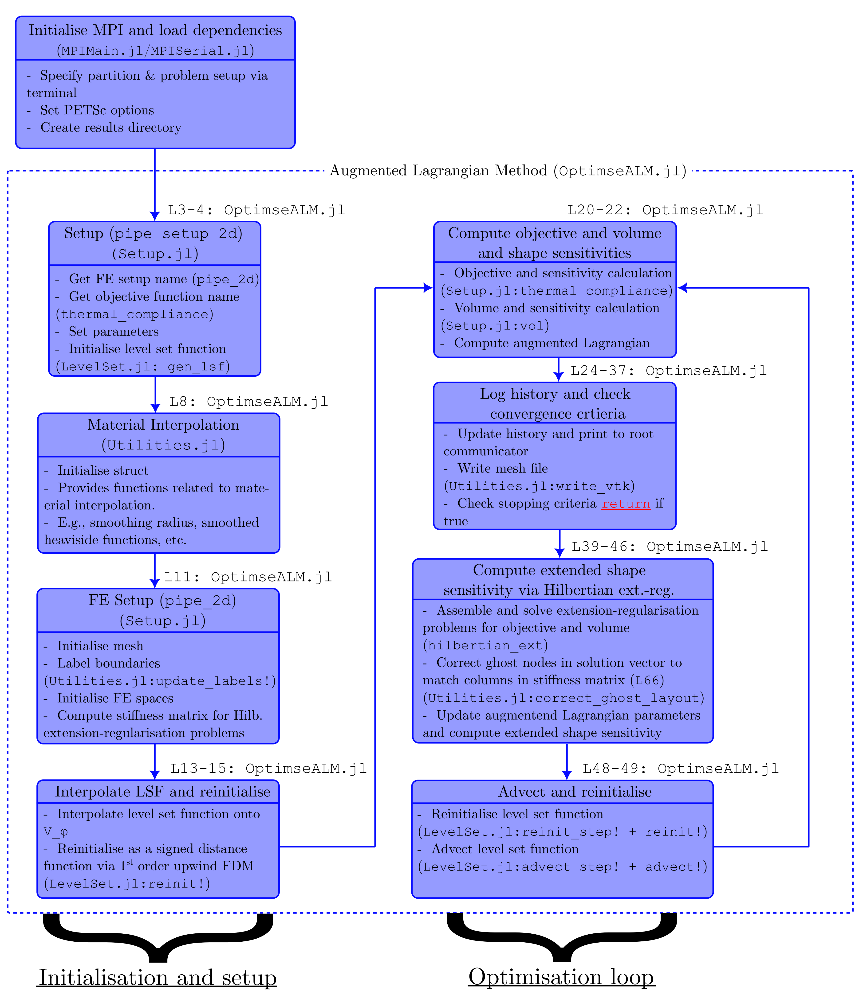

# LSTO_Distributed

## To-do for paper:

- [ ] Benchmark and scaling tests
- [ ] Implement optimisation problems and test:

  |          **Problem type**         | **2D**  | **3D**  | **Serial** | **MPI** |
  |:---------------------------------:|---------|---------|:----------:|---------|
  | Minimum thermal compliance        | &#9745; | &#9745; | &#9745;    | &#9745; |
  | Minimum elastic compliance        | &#9745; | &#9745; | &#9745;    | &#9745; |
  | Inverter mechanism                | &#9745; | &#9745;** | &#9745;    | &#9745;* |
  | Elastic inverse homogenisation    | &#9745; | &#9745;** | &#9745;    | &#9745;* |
  | Minimum NL thermal compliance     | &#9745; | &#9745;** | &#9745;    | &#9745;* |
  | Minimum hyperelastic compliance   | &#9745; | &#9745;** | &#9745;    | &#9745;* |

*: 3D only.

**: Need to test.

- [x] Testing automatic differentation
  * &#9745; Test inverter mechanism problem with analytic adjoint. Edit: See discussion below.
  * &#9745; Compare to ray integrals for multi-material ([Paper](https://doi.org/10.1051/cocv/2013076)) and additive manufacturing ([Paper](https://doi.org/10.1051/m2an/2019056)) problems. Edit: We cannot use AD for these. Related to discussion below.
- [x] Implement HPM ([Paper](https://doi.org/10.1007/s00158-023-03663-0))
- [x] Implement `NonlinearFEStateMap` - still need to do further testing on AD.

## Future work (not this paper)
- [ ] Implement CutFEM in serial using GridapEmbedded.
- [ ] Extend to parallel (I'm sure this will be a massive undertaking)

## Known bugs/issues
- [x] Higher order FEs breaks `Advection.jl` in parallel.
- [x] `create_dof_permutation` doesn't work for periodic models.
- [x] `MultiFieldFESpace` breaks `ElasticitySolver`
- [x] `NonlinearFEStateMap` breaks in parallel due need for transpose of jacobian. This likely means there is also a bug in `AffineFEStateMap` when dealing with non-symmetric weak forms. See `scripts/nonlinear_adjoint_MWE.jl`
- [ ] Inverse homogenisation problems over allocate the stiffness matrix. Only one stiffness matrix should be assembled, then we should create a larger block matrix from this.
- [ ] There appears to be a memory leak in `write_vtk`.
- [ ] PETSc's GAMG preconditioner breaks for split Dirichlet DoFs (e.g., x constrained while y free for a single node). There is no simple fix for this. I would recommend instead using MUMPS or another preconditioner.

## Some notes on auto differentiation

The shape derivative of $J^\prime(\Omega)$ can be defined as the Frechet derivative under a mapping $\tilde\Omega = (\boldsymbol{I}+\boldsymbol{\theta})(\Omega)$ at $\boldsymbol{0}$ with

$$J(\tilde{\Omega})=J(\Omega)+J^\prime(\Omega)(\boldsymbol{\theta})+o(\lVert\boldsymbol{\theta}\rVert).$$

Consider some illustrative examples. First suppose that $J_1(\Omega)=\int_\Omega f(\boldsymbol{x})\~\mathrm{d}\boldsymbol{x}$, then

$$J_1(\tilde{\Omega})=\int_{\tilde{\Omega}}f(\tilde{\boldsymbol{x}})\~\mathrm{d}\boldsymbol{x}=\int_{\Omega}f(\boldsymbol{x}+\boldsymbol{\theta})\left\lvert\frac{\partial\boldsymbol{\tilde{x}}}{\partial\boldsymbol{x}}\right\rvert\~\mathrm{d}\boldsymbol{x}=...=J(\Omega)+\int_{\partial\Omega}f(\boldsymbol{x})\~\boldsymbol{\theta}\cdot\boldsymbol{n}\~\mathrm{d}s+...$$

So, for this simple case $$J_1^\prime(\Omega)(\boldsymbol{\theta})=\int_{\partial\Omega}f(\boldsymbol{x})\~\boldsymbol{\theta}\cdot\boldsymbol{n}\~\mathrm{d}s\~\~(\star).$$ For a surface integral $J_2(\Omega)=\int_{\partial\Omega} f(\boldsymbol{x})\~\mathrm{d}s$, one finds in a similar way $$J_2^\prime(\Omega)(\boldsymbol{\theta})=\int_{\partial\Omega}(f\nabla\cdot\boldsymbol{n}+\nabla f\cdot\boldsymbol{n})\~\boldsymbol{\theta}\cdot\boldsymbol{n}\~\mathrm{d}s.$$

Suppose that we attribute a signed distance function $\varphi:D\rightarrow\mathbb{R}$ to our domain $\Omega\subset D$ with $\bar{\Omega}=\lbrace \boldsymbol{x}:\varphi(\boldsymbol{x})\leq0\rbrace$ and $\Omega^\complement=\lbrace \boldsymbol{x}:\varphi(\boldsymbol{x})>0\rbrace$. We can then define a smooth characteristic function $\chi_\epsilon:D\rightarrow[\epsilon,1]$ as $\chi_\epsilon(\boldsymbol{x})=(1-H(\varphi(\boldsymbol{x})))+\epsilon H(\varphi(\boldsymbol{x}))$ where $H$ is a smoothed Heaviside function with smoothing radius $\eta$, and $\epsilon\ll1$ allows for an ersatz material approximation. Of course, $\epsilon$ can be taken as zero depending on the computational regime. We can now rewrite $J_1$ over the computational domain $D$ as $J_{1\Omega}(\varphi)=\int_D \chi_\epsilon(\varphi)f(\boldsymbol{x})\~\mathrm{d}\boldsymbol{x}$. Considering the directional derivative of $J_{1\Omega}$ under a variation $\tilde{\varphi}=\varphi+sv$ gives

$$J_{1\Omega}^\prime(\varphi)(v)=\frac{\mathrm{d}}{\mathrm{d}s} J_{1\Omega}(\varphi+sv)\rvert_{s=0}=\int_D v\chi_\epsilon^\prime(\varphi)f(\boldsymbol{x})\~\mathrm{d}\boldsymbol{x}$$

or

$$J_{1\Omega}^\prime(\varphi)(v)=\int_D (\epsilon-1)vH^\prime(\varphi)f(\boldsymbol{x})\~\mathrm{d}\boldsymbol{x}$$

The final result of course does not yet match $(\star)$. Over a fixed computational domain we may relax integrals to be over all of $D$ via $\mathrm{d}s = H'(\varphi)\lvert\nabla\varphi\rvert\~\mathrm{d}\boldsymbol{x}$. In addition suppose we take $\boldsymbol{\theta}=-v\boldsymbol{n}$. Then $(\star)$ can be rewritten as
$$J_1^\prime(\Omega)(v\boldsymbol{n})=-\int_{D}vf(\boldsymbol{x})H'(\varphi)\lvert\nabla\varphi\rvert\~\mathrm{d}s$$

As $\varphi$ is a signed distance function we have $\lvert\nabla\varphi\rvert=1$ for $D\setminus\Sigma$ where $\Sigma$ is the skeleton of $\Omega$ and $\Omega^\complement$. Furthermore, $H'(\varphi)$ provides support only within a band of $\partial\Omega$. Therefore, we have that almost everywhere

$${\huge{|}} J_1^\prime(\Omega)(v\boldsymbol{n}) - J_{1\Omega}^\prime(\varphi)(v){\huge{|}}=O(\epsilon),$$

with equaility as $\epsilon\rightarrow0$.

This is not the case when we consider applying the same process to a surface integral such as $J_2(\Omega)$. In this case, we can never recover $\nabla f$ under a variation of $\varphi$. For argument sake we can take $J_{2\Omega}(\varphi)=\int_D f(\boldsymbol{x})H'(\varphi)\lvert\nabla\varphi\rvert\~\mathrm{d}\boldsymbol{x}$. Then a variation in $\varphi$ gives
$$J_{2\Omega}^\prime(\varphi)(v)=\int_D f(\boldsymbol{x})\left(H^{\prime\prime}(\varphi)\lvert\nabla\varphi\rvert v + H^\prime(\varphi)\frac{\nabla v\cdot\nabla \varphi}{\lvert\nabla\varphi\rvert}\right)\~\mathrm{d}\boldsymbol{x}.$$
On the other hand, relaxing the shape derivative of $J_2$ in the same way as above gives
$$J_2^\prime(\Omega)(-v\boldsymbol{n})=\int_{D}-\left(f\nabla\cdot\frac{\nabla\varphi}{\lvert\nabla\varphi\rvert}+\nabla f\cdot\frac{\nabla\varphi}{\lvert\nabla\varphi\rvert}\right)vH'(\varphi)\lvert\nabla\varphi\rvert\~\mathrm{d}\boldsymbol{x}.$$

### Adding PDE constraints
Consider $\Omega\subset D$ with $J(\Omega)=\int_\Omega j(\boldsymbol{u})\~\mathrm{d}\boldsymbol{x}+\int_{\Gamma_N} l_1(\boldsymbol{u})\~\mathrm{d}s+\int_{\Gamma_R} l_2(\boldsymbol{u})\~\mathrm{d}s$ where $\boldsymbol{u}$ satisfies

$$
\begin{aligned}
-\mathrm{div}(\boldsymbol{C\varepsilon}(\boldsymbol{u})) &= \boldsymbol{f}\text{ on }\Omega, \\
\boldsymbol{u} &= \boldsymbol{0}\text{ on }\Gamma_D,\\
\boldsymbol{C\varepsilon}(\boldsymbol{u})\boldsymbol{n} &= \boldsymbol{0}\text{ on }\Gamma_0,\\
\boldsymbol{C\varepsilon}(\boldsymbol{u})\boldsymbol{n} &= \boldsymbol{g}\text{ on }\Gamma_N,\\
\boldsymbol{C\varepsilon}(\boldsymbol{u})\boldsymbol{n} &= -\boldsymbol{w}(\boldsymbol{u})\text{ on }\Gamma_R.\\
\end{aligned}
$$

In the above $\boldsymbol{\varepsilon}$ is the strain tensor, $\boldsymbol{C}$ is the stiffness tensor, $\Gamma_0 = \partial\Omega\setminus(\Gamma_D\cup\Gamma_N\cup\Gamma_R)$, and $\Gamma_D$, $\Gamma_N$, $\Gamma_R$ are required to be fixed.

#### Shape derivative
Let us first consider the shape derivative of $J$. Disregarding embedding inside the computational domain $D$, the above strong form can be written in weak form as: *Find* $\boldsymbol{u}\in H^1_{\Gamma_D}(\Omega)^d$ *such that*
$$\int_{\Omega} \boldsymbol{C\varepsilon}(\boldsymbol{u})\boldsymbol{\varepsilon}(\boldsymbol{v})\~\mathrm{d}\boldsymbol{x}+\int_{\Gamma_R}\boldsymbol{w}(\boldsymbol{u})\cdot\boldsymbol{v}\~\mathrm{d}s=\int_\Omega \boldsymbol{f}\cdot\boldsymbol{v}\~\mathrm{d}\boldsymbol{x}+\int_{\Gamma_N}\boldsymbol{g}\cdot\boldsymbol{v}\~\mathrm{d}s,\~\forall \boldsymbol{v}\in H^1_{\Gamma_D}(\Omega)^d.$$

Following Céa's formal adjoint method we introduce the following Lagrangian

$$
\begin{aligned}
\mathcal{L}(\Omega,\boldsymbol{v},\boldsymbol{q})=&\int_\Omega j(\boldsymbol{v})\~\mathrm{d}\boldsymbol{x}+\int_{\Gamma_N} l_1(\boldsymbol{v})\~\mathrm{d}s+\int_{\Gamma_R} l_2(\boldsymbol{v})\~\mathrm{d}s+\int_{\Omega} \boldsymbol{C\varepsilon}(\boldsymbol{v})\boldsymbol{\varepsilon}(\boldsymbol{q})\~\mathrm{d}\boldsymbol{x}\\
&+\int_{\Gamma_R}\boldsymbol{w}(\boldsymbol{v})\cdot\boldsymbol{q}\~\mathrm{d}s-\int_\Omega \boldsymbol{f}\cdot\boldsymbol{q}\~\mathrm{d}\boldsymbol{x}-\int_{\Gamma_N}\boldsymbol{g}\cdot\boldsymbol{q}\~\mathrm{d}s\\
&-\int_{\Gamma_D}\boldsymbol{q}\cdot\boldsymbol{C\varepsilon}(\boldsymbol{v})\boldsymbol{n}+\boldsymbol{v}\cdot\boldsymbol{C\varepsilon}(\boldsymbol{q})\boldsymbol{n}\~\mathrm{d}s\\
\end{aligned}
$$

where $\boldsymbol{v},\boldsymbol{q}\in H^1(\mathbb{R}^d)^d$. Requiring stationarity of the Lagrangian and taking a partial derivative of $\mathcal{L}$ with respect to $\boldsymbol{q}$ in the direction $\boldsymbol{\phi}\in H^1(\mathbb{R}^d)^d$ gives

$$
\begin{aligned}
0=\frac{\partial\mathcal{L}}{\partial\boldsymbol{q}}(\boldsymbol{\phi})&=\int_{\Omega} \boldsymbol{C\varepsilon}(\boldsymbol{v})\boldsymbol{\varepsilon}(\boldsymbol{\phi})\~\mathrm{d}\boldsymbol{x}+\int_{\Gamma_R}\boldsymbol{w}(\boldsymbol{v})\cdot\boldsymbol{\phi}\~\mathrm{d}s-\int_\Omega \boldsymbol{f}\cdot\boldsymbol{\phi}\~\mathrm{d}\boldsymbol{x}-\int_{\Gamma_N}\boldsymbol{g}\cdot\boldsymbol{\phi}\~\mathrm{d}s\\
&\quad-\int_{\Gamma_D}\boldsymbol{\phi}\cdot\boldsymbol{C\varepsilon}(\boldsymbol{v})\boldsymbol{n}+\boldsymbol{v}\cdot\boldsymbol{C\varepsilon}(\boldsymbol{\phi})\boldsymbol{n}\~\mathrm{d}s\\
&=\int_\Omega\boldsymbol{\phi}\cdot(-\mathrm{div}(\boldsymbol{C\varepsilon}(\boldsymbol{u}))-\boldsymbol{f})\~\mathrm{d}\boldsymbol{x}+\int_{\Gamma_R}\boldsymbol{\phi}\cdot(\boldsymbol{C\varepsilon}(\boldsymbol{v})\boldsymbol{n}+\boldsymbol{w}(\boldsymbol{v}))\~\mathrm{d}s\\
&\quad+\int_{\Gamma_N}\boldsymbol{\phi}\cdot(\boldsymbol{C\varepsilon}(\boldsymbol{v})\boldsymbol{n}-\boldsymbol{g})\~\mathrm{d}s-\int_{\Gamma_D}\boldsymbol{v}\cdot\boldsymbol{C\varepsilon}(\boldsymbol{\phi})\boldsymbol{n}\~\mathrm{d}s+\int_{\Gamma_0}\boldsymbol{\phi}\cdot\boldsymbol{C\varepsilon}(\boldsymbol{v})\boldsymbol{n}\~\mathrm{d}s
\end{aligned}
$$

after applying integration by parts. Under a suitable variations of $\boldsymbol{\phi}$, the state equation and boundary conditions are generated as required. In other words, $\boldsymbol{v}$ is given by the solution $\boldsymbol{u}$ to the equations of state. We can derive the adjoint equation by again requiring stationarity of the Lagrangian and taking a partial derivative of $\mathcal{L}$ with respect to $\boldsymbol{v}$ in the direction $\boldsymbol{\phi}\in H^1(\mathbb{R}^d)^d$. This gives

$$
\begin{aligned}
0=\frac{\partial\mathcal{L}}{\partial\boldsymbol{v}}(\boldsymbol{\phi})&=\int_\Omega \boldsymbol{\phi}\cdot j^\prime(\boldsymbol{v})\~\mathrm{d}\boldsymbol{x}+\int_{\Gamma_N} \boldsymbol{\phi}\cdot l_1^\prime(\boldsymbol{v})\~\mathrm{d}s+\int_{\Gamma_R} \boldsymbol{\phi}\cdot l_2^\prime(\boldsymbol{v})\~\mathrm{d}s+\int_{\Omega} \boldsymbol{C\varepsilon}(\boldsymbol{\phi})\boldsymbol{\varepsilon}(\boldsymbol{q})\~\mathrm{d}\boldsymbol{x}\\
&\quad+\int_{\Gamma_R}\boldsymbol{\phi}\cdot J_{\boldsymbol{w}}(\boldsymbol{v})\cdot\boldsymbol{q}\~\mathrm{d}s-\int_{\Gamma_D}\boldsymbol{q}\cdot\boldsymbol{C\varepsilon}(\boldsymbol{\phi})\boldsymbol{n}+\boldsymbol{\phi}\cdot\boldsymbol{C\varepsilon}(\boldsymbol{q})\boldsymbol{n}\~\mathrm{d}s\\
&=\int_{\Omega} \boldsymbol{\phi}\cdot(-\mathrm{div}(\boldsymbol{C\varepsilon}(\boldsymbol{q}))-j^\prime(\boldsymbol{v}))\~\mathrm{d}\boldsymbol{x}+\int_{\Gamma_N} \boldsymbol{\phi}\cdot (\boldsymbol{C\varepsilon}(\boldsymbol{q})\boldsymbol{n}+l_1^\prime(\boldsymbol{v}))\~\mathrm{d}s\\
&\quad+\int_{\Gamma_R} \boldsymbol{\phi}\cdot (\boldsymbol{C\varepsilon}(\boldsymbol{q})\boldsymbol{n}+J_{\boldsymbol{w}}(\boldsymbol{v})\cdot\boldsymbol{q}+l_2^\prime(\boldsymbol{v}))\~\mathrm{d}s-\int_{\Gamma_D}\boldsymbol{q}\cdot\boldsymbol{C\varepsilon}(\boldsymbol{\phi})\boldsymbol{n}\~\mathrm{d}s\\
&\quad+\int_{\Gamma_0}\boldsymbol{\phi}\cdot\boldsymbol{C\varepsilon}(\boldsymbol{q})\boldsymbol{n}\~\mathrm{d}s
\end{aligned}
$$

where integration by parts has been applied. The adjoint equations are then generated under suitable variations of $\boldsymbol{\phi}$, while the previous result $\boldsymbol{v}=\boldsymbol{u}$ implies that we can identify a unique $\boldsymbol{q}=\boldsymbol{\lambda}$ that satisfies stationaity. In particular,

$$
\begin{aligned}
-\mathrm{div}(\boldsymbol{C\varepsilon}(\boldsymbol{\lambda})) &= j^\prime(\boldsymbol{u})\text{ on }\Omega, \\
\boldsymbol{\lambda} &= \boldsymbol{0}\text{ on }\Gamma_D,\\
\boldsymbol{C\varepsilon}(\boldsymbol{\lambda})\boldsymbol{n} &= \boldsymbol{0} \text{ on }\Gamma_0,\\
\boldsymbol{C\varepsilon}(\boldsymbol{\lambda})\boldsymbol{n} &= -l_1^\prime(\boldsymbol{u})\text{ on }\Gamma_N,\\
\boldsymbol{C\varepsilon}(\boldsymbol{\lambda})\boldsymbol{n} &= -J_{\boldsymbol{w}}(\boldsymbol{u})\cdot\boldsymbol{\lambda}-l_2^\prime(\boldsymbol{u}) \text{ on }\Gamma_R.\\
\end{aligned}
$$

The shape derivative of $J(\Omega)=\mathcal{L}(\Omega,\boldsymbol{u},\boldsymbol{\lambda})$ then follows by application of the chainrule along with the shape derivative results for $J_1$ and $J_2$ above:

$$
\begin{aligned}
J^\prime(\Omega)(\boldsymbol{\theta})&=\frac{\partial\mathcal{L}}{\partial\Omega}(\Omega,\boldsymbol{u},\boldsymbol{\lambda})(\boldsymbol{\theta})+\cancel{\frac{\partial\mathcal{L}}{\partial\boldsymbol{v}}(\Omega,\boldsymbol{u},\boldsymbol{\lambda})}(\boldsymbol{u}^\prime(\boldsymbol{\theta}))+\cancel{\frac{\partial\mathcal{L}}{\partial\boldsymbol{q}}(\Omega,\boldsymbol{u},\boldsymbol{\lambda})}(\boldsymbol{\lambda}^\prime(\boldsymbol{\theta}))\\
&=\int_{\Gamma_0} (\boldsymbol{C\varepsilon}(\boldsymbol{u})\boldsymbol{\varepsilon}(\boldsymbol{\lambda})+j(\boldsymbol{u}) -\boldsymbol{f}\cdot\boldsymbol{\lambda})\~\boldsymbol{\theta}\cdot\boldsymbol{n}\~\mathrm{d}s.
\end{aligned}
$$

As required. Note that in the above, we have used that $\boldsymbol{\theta}\cdot\boldsymbol{n}=0$ on $\Gamma_N$, $\Gamma_R$, and $\Gamma_D$.


#### Derivative in $\varphi$
Let us now return to derivatives of $J$ with respect to $\varphi$ over the whole computational domain. As previously, suppose that we rewrite $J$ as 

$$\hat{\mathcal{J}}(\varphi)=\int_D \chi_\epsilon(\varphi)j(\boldsymbol{u})\~\mathrm{d}\boldsymbol{x}+\int_{\Gamma_N} l_1(\boldsymbol{u})\~\mathrm{d}s+\int_{\Gamma_R} l_2(\boldsymbol{u})\~\mathrm{d}s$$

where $\boldsymbol{u}$ satisfies the state equations as previously with relaxation over the whole computational domain $D$ as

$$
\begin{aligned}
-\mathrm{div}(\chi_\epsilon(\varphi)\boldsymbol{C\varepsilon}(\boldsymbol{u})) &= \chi_\epsilon(\varphi)\boldsymbol{f}\text{ on }D, \\
\boldsymbol{u} &= \boldsymbol{0}\text{ on }\Gamma_D,\\
\chi_\epsilon(\varphi)\boldsymbol{C\varepsilon}(\boldsymbol{u})\boldsymbol{n} &= \boldsymbol{0}\text{ on }\Gamma_0,\\
\chi_\epsilon(\varphi)\boldsymbol{C\varepsilon}(\boldsymbol{u})\boldsymbol{n} &= \boldsymbol{g}\text{ on }\Gamma_N,\\
\chi_\epsilon(\varphi)\boldsymbol{C\varepsilon}(\boldsymbol{u})\boldsymbol{n} &= -\boldsymbol{w}(\boldsymbol{u})\text{ on }\Gamma_R,\\
\end{aligned}
$$

and admits a weak form: *Find* $\boldsymbol{u}\in H^1_{\Gamma_D}(\Omega)^d$ *such that*

$$
\int_{\Omega} \chi_\epsilon(\varphi)\boldsymbol{C\varepsilon}(\boldsymbol{u})\boldsymbol{\varepsilon}(\boldsymbol{v})\~\mathrm{d}\boldsymbol{x}+\int_{\Gamma_R}\boldsymbol{w}(\boldsymbol{u})\cdot\boldsymbol{v}\~\mathrm{d}s=\int_D\chi_\epsilon(\varphi)\boldsymbol{f}\cdot\boldsymbol{v}\~\mathrm{d}\boldsymbol{x}+\int_{\Gamma_N}\boldsymbol{g}\cdot\boldsymbol{v}\~\mathrm{d}s,\~\forall \boldsymbol{v}\in H^1_{\Gamma_D}(\Omega)^d.
$$

At this stage it is important to note that this is almost verbatim as the case without relaxation over $D$. Indeed, we may follow Céa's method as previously with only a minor adjustment to the Lagrangian that relaxes it over $D$:

$$
\begin{aligned}
\hat{\mathcal{L}}(\varphi,\boldsymbol{v},\boldsymbol{q})=&\int_D \chi_\epsilon(\varphi)j(\boldsymbol{v})\~\mathrm{d}\boldsymbol{x}+\int_{\Gamma_N} l_1(\boldsymbol{v})\~\mathrm{d}s+\int_{\Gamma_R} l_2(\boldsymbol{v})\~\mathrm{d}s+\int_{D}\chi_\epsilon(\varphi)\boldsymbol{C\varepsilon}(\boldsymbol{v})\boldsymbol{\varepsilon}(\boldsymbol{q})\~\mathrm{d}\boldsymbol{x}\\
&+\int_{\Gamma_R}\boldsymbol{w}(\boldsymbol{v})\cdot\boldsymbol{q}\~\mathrm{d}s-\int_D \chi_\epsilon(\varphi) \boldsymbol{f}\cdot\boldsymbol{q}\~\mathrm{d}\boldsymbol{x}-\int_{\Gamma_N}\boldsymbol{g}\cdot\boldsymbol{q}\~\mathrm{d}s\\
&-\int_{\Gamma_D}\boldsymbol{q}\cdot\chi_\epsilon(\varphi)\boldsymbol{C\varepsilon}(\boldsymbol{v})\boldsymbol{n}+\boldsymbol{v}\cdot\chi_\epsilon(\varphi)\boldsymbol{C\varepsilon}(\boldsymbol{q})\boldsymbol{n}\~\mathrm{d}s.\\
\end{aligned}
$$

As a result the partial derivatives of $\hat{\mathcal{L}}$ in $\boldsymbol{v}$ and $\boldsymbol{q}$ are the same as previously up to relaxation of $D$ with $\chi_\epsilon(\varphi)$, i.e.,

$$
\begin{aligned}
0=\frac{\partial\hat{\mathcal{L}}}{\partial\boldsymbol{q}}(\boldsymbol{\phi})&=\int_\Omega\boldsymbol{\phi}\cdot(-\mathrm{div}(\chi_\epsilon(\varphi)\boldsymbol{C\varepsilon}(\boldsymbol{u}))-\chi_\epsilon(\varphi)\boldsymbol{f})\~\mathrm{d}\boldsymbol{x}+\int_{\Gamma_R}\boldsymbol{\phi}\cdot(\chi_\epsilon(\varphi)\boldsymbol{C\varepsilon}(\boldsymbol{v})\boldsymbol{n}+\boldsymbol{w}(\boldsymbol{v}))\~\mathrm{d}s\\
&\quad+\int_{\Gamma_N}\boldsymbol{\phi}\cdot(\chi_\epsilon(\varphi)\boldsymbol{C\varepsilon}(\boldsymbol{v})\boldsymbol{n}-\boldsymbol{g})\~\mathrm{d}s-\int_{\Gamma_D}\boldsymbol{v}\cdot\chi_\epsilon(\varphi)\boldsymbol{C\varepsilon}(\boldsymbol{\phi})\boldsymbol{n}\~\mathrm{d}s+\int_{\Gamma_0}\boldsymbol{\phi}\cdot\chi_\epsilon(\varphi)\boldsymbol{C\varepsilon}(\boldsymbol{v})\boldsymbol{n}\~\mathrm{d}s
\end{aligned}
$$

and

$$
\begin{aligned}
0=\frac{\partial\hat{\mathcal{L}}}{\partial\boldsymbol{v}}(\boldsymbol{\phi})&=\int_{\Omega} \boldsymbol{\phi}\cdot(-\mathrm{div}(\chi_\epsilon(\varphi)\boldsymbol{C\varepsilon}(\boldsymbol{q}))-\chi_\epsilon(\varphi)j^\prime(\boldsymbol{v}))\~\mathrm{d}\boldsymbol{x}+\int_{\Gamma_N} \boldsymbol{\phi}\cdot (\chi_\epsilon(\varphi)\boldsymbol{C\varepsilon}(\boldsymbol{q})\boldsymbol{n}+l_1^\prime(\boldsymbol{v}))\~\mathrm{d}s\\
&\quad+\int_{\Gamma_R} \boldsymbol{\phi}\cdot (\chi_\epsilon(\varphi)\boldsymbol{C\varepsilon}(\boldsymbol{q})\boldsymbol{n}+J_{\boldsymbol{w}}(\boldsymbol{v})\cdot\boldsymbol{q}+l_2^\prime(\boldsymbol{v}))\~\mathrm{d}s-\int_{\Gamma_D}\boldsymbol{q}\cdot\chi_\epsilon(\varphi)\boldsymbol{C\varepsilon}(\boldsymbol{\phi})\boldsymbol{n}\~\mathrm{d}s\\
&\quad+\int_{\Gamma_0}\boldsymbol{\phi}\cdot\chi_\epsilon(\varphi)\boldsymbol{C\varepsilon}(\boldsymbol{q})\boldsymbol{n}\~\mathrm{d}s.
\end{aligned}
$$

Therefore, we may identify $\boldsymbol{v}=\boldsymbol{u}$ and $\boldsymbol{q}=\boldsymbol{\lambda}$ where the latter satisfies the adjoint equation

$$
\begin{aligned}
-\mathrm{div}(\chi_\epsilon(\varphi)\boldsymbol{C\varepsilon}(\boldsymbol{\lambda})) &= \chi_\epsilon(\varphi)j^\prime(\boldsymbol{u})\text{ on }\Omega, \\
\boldsymbol{\lambda} &= \boldsymbol{0}\text{ on }\Gamma_D,\\
\chi_\epsilon(\varphi)\boldsymbol{C\varepsilon}(\boldsymbol{\lambda})\boldsymbol{n} &= \boldsymbol{0} \text{ on }\Gamma_0,\\
\chi_\epsilon(\varphi)\boldsymbol{C\varepsilon}(\boldsymbol{\lambda})\boldsymbol{n} &= -l_1^\prime(\boldsymbol{u})\text{ on }\Gamma_N,\\
\chi_\epsilon(\varphi)\boldsymbol{C\varepsilon}(\boldsymbol{\lambda})\boldsymbol{n} &= -J_{\boldsymbol{w}}(\boldsymbol{u})\cdot\boldsymbol{\lambda}-l_2^\prime(\boldsymbol{u}) \text{ on }\Gamma_R.\\
\end{aligned}
$$

This exactly as previously up to relaxation over $D$. Finally, The derivative of $\hat{J}(\varphi)=\hat{\mathcal{L}}(\varphi,\boldsymbol{u},\boldsymbol{\lambda})$ then follows by application of the chainrule as previously:

$$
\begin{aligned}
\hat{J}^\prime(\varphi)(v)&=\frac{\partial\hat{\mathcal{L}}}{\partial\varphi}(\varphi,\boldsymbol{u},\boldsymbol{\lambda})(v)+\cancel{\frac{\partial\hat{\mathcal{L}}}{\partial\boldsymbol{v}}(\varphi,\boldsymbol{u},\boldsymbol{\lambda})}(\boldsymbol{u}^\prime(v))+\cancel{\frac{\partial\hat{\mathcal{L}}}{\partial\boldsymbol{q}}(\varphi,\boldsymbol{u},\boldsymbol{\lambda})}(\boldsymbol{\lambda}^\prime(v))\\
&=\int_D v(\boldsymbol{C\varepsilon}(\boldsymbol{u})\boldsymbol{\varepsilon}(\boldsymbol{\lambda})+j(\boldsymbol{u})- \boldsymbol{f}\cdot\boldsymbol{\lambda})\chi^\prime_\epsilon(\varphi)\~\mathrm{d}\boldsymbol{x}\\
&=\int_D v(\epsilon-1)(\boldsymbol{C\varepsilon}(\boldsymbol{u})\boldsymbol{\varepsilon}(\boldsymbol{\lambda})+j(\boldsymbol{u})- \boldsymbol{f}\cdot\boldsymbol{\lambda})H^\prime(\varphi)\~\mathrm{d}\boldsymbol{x}
\end{aligned}
$$

where we have used that $v=0$ on $\Gamma_D$ as previously. As previously taking $\boldsymbol{\theta}=v\boldsymbol{n}$ and relaxing the shape derivative of $J$ over $D$ with a signed distance function $\varphi$ yields: 

$${\huge{|}} J^\prime(\Omega)(v\boldsymbol{n}) - \hat{\mathcal{J}}^\prime(\varphi)(v){\huge{|}}=O(\epsilon).$$

### What is not captured by a Gateaux derivative at $\varphi$?
Owing to the fact that we do not fully capture a variation of the doamin in $\varphi$, the Gateaux derivative of certain types of functionals will not match the shape derivative. For example the shape derivative of $J_2$ and the Gateaux derivative of $J_{2\Omega}$ fail to match even in the relaxed setting. Regardless of this, accurate resolution of $J_2$ is difficult owing to the appearance of mean curvature. This problem is further exacebated when a discretisation of the boundary is not available. <br /><br />

In addition, functionals of the signed distance function posed over the whole bounding domain $D$ admit a special structure under shape differentiation ([Paper](https://doi.org/10.1051/m2an/2019056)). Such cases are not captured by a Gateaux derivative at $\varphi$ under relaxation. It is unclear whether these cases will be captured by considering a Gateaux derivative of the mapping

$$
\varphi \mapsto \int_{\Omega(\varphi)}\varphi\~\mathrm{d}\boldsymbol{x} + \int_{\Omega(\varphi)^\complement}\varphi\~\mathrm{d}\boldsymbol{x}.
$$

<br /><br /><br /><br /><br /><br /><br /><br /><br />
---------------------------------------------------------------------------------------------------
# Deprecated:
## Setup:

1. Download and activate repo in Julia using `]` followed by `activate .`.
2. Download dependencies using `]` followed by `instantiate`.
3. Configure    
    * (Desktop) install `mpiexecjl` by running `using MPI; MPI.install_mpiexecjl()` in Julia. Add `.../.julia/bin/` to system path.
    * (HPC) It is best to utilise pre-exisiting MPI and PETSc installations on the HPC. The PBS Pro script provided below builds required packges with system settings.
4. Run 
    * (Desktop) `mpiexecjl` from terminal (GIT Bash if on Windows). E.g.,
        `mpiexecjl --project=. -n 4 julia MainMPI.jl pipe_setup_2d 2 2`
    * (HPC) Queue a run script - see examples provided.

## Options:
We typically execute `mpiexecjl` from the terminal via the following
    `mpiexecjl --project=. -n NP julia MainMPI.jl SETUP_NAME NX NY NZ`
where
* `NP` -> Number of processors to launch,
* `SETUP_NAME` -> Name of setup function,
* `NX` -> Number of partitions in X,
* `NY` -> Number of partitions in Y,
* `NZ` -> Number of partitions in Z (optional).


`MainMPI` can also be replaced by `MainSerial` to run the code in serial mode (currently this is quite slow?).

## Output & Visualisation
Output files consist of a `.csv` file containing the iteration history, `.pvtu` files and `.vtu` files in corresponding subdirectories. For the augmented Lagrangian method the `history.csv` file consists of three columns for the objective, volume, and Lagrangian respectively.

Results can be visualised in Paraview via the following:

&nbsp;&nbsp;&nbsp;&nbsp;&nbsp;&nbsp;Open (any `.pvtu`) -> Apply -> `CTRL + Space` -> `Iso Volume`

Use the following settings in the `Iso Volume` filter: `Input Scalars` = `phi`, `Minimum` = -1, `Maximum` = 0.

Bug: Currently `.pvtu` files contain the whole path to the corresponding `.vtu` instead of the relative path. This is caused by passing the whole path to `write_vtk`. Passing the relative path to `write_vtk` includes the location folder in the path to each piece (`.vtu` file). If moving several visualisation files use the command (replace `/` by `\/` in `PATH` below)
    `sed -i 's/PATH/./g' *.pvtu`

## Algorithm Overview:

The flowchart below gives a rough overview of the augmented Lagrangian-based optimisation algorithm for the problem `pipe_setup_2d` with objective `thermal_compliance`.



## HPC PBS Scripts:

The following PBS script is provided for setting up `MPI.jl` in conjuction with `GridapDistributed.jl`, `GridapPETSc.jl`, and `MUMPS` on a PBS Pro-based HPC cluster:
```
#!/bin/bash -l

#PBS -P LSTO_Distributed_Setup
#PBS -l ncpus=1
#PBS -l mem=32GB
#PBS -l walltime=00:30:00
#PBS -j oe

module load julia/1.8.3-linux-x86_64
module load mumps/5.5.1-foss-2022a-metis
module load petsc/3.18.6-foss-2022a
module load openmpi/4.1.4-gcc-11.3.0

# Path to PETSc Library - replace with appropriate system path
export JULIA_PETSC_LIBRARY=$EBROOTPETSC/lib/libpetsc.so 

cd $PBS_O_WORKDIR

julia --project=. -e 'using Pkg; Pkg.instantiate()'
echo '------------------------------------------------------------'
julia --project -e 'using Pkg; Pkg.add("MPIPreferences"); 
    using MPIPreferences; MPIPreferences.use_system_binary()'
echo '------------------------------------------------------------'
julia --project=. -e 'using MPI; MPI.install_mpiexecjl()'
echo '------------------------------------------------------------'
julia --project=. -e 'using Pkg; Pkg.build("MPI"; verbose=true);
    Pkg.build("GridapPETSc")'
echo '------------------------------------------------------------'
julia --project=. -e 'using MPI, Gridap, GridapDistributed, GridapPETSc'
echo '------------------------------------------------------------'
echo 'Done'
```

The following PBS script can be used to run the code on a PBS Pro-based HPC:
```
#!/bin/bash -l

#PBS -P LSTO_Dist_Pipe
#PBS -l cputype=7713
#PBS -l ncpus=27
#PBS -l mpiprocs=27
#PBS -l mem=128GB
#PBS -l walltime=48:00:00
#PBS -j oe

module load julia/1.8.3-linux-x86_64
module load mumps/5.5.1-foss-2022a-metis
module load petsc/3.18.6-foss-2022a
module load openmpi/4.1.4-gcc-11.3.0

# Path to PETSc Library - replace with appropriate system path
export JULIA_PETSC_LIBRARY=$EBROOTPETSC/lib/libpetsc.so
export mpiexecjl=~/.julia/bin/mpiexecjl

cd $PBS_O_WORKDIR

$mpiexecjl --project=. -n 27 julia ./MainMPI.jl pipe_setup_3d 3 3 3
```
