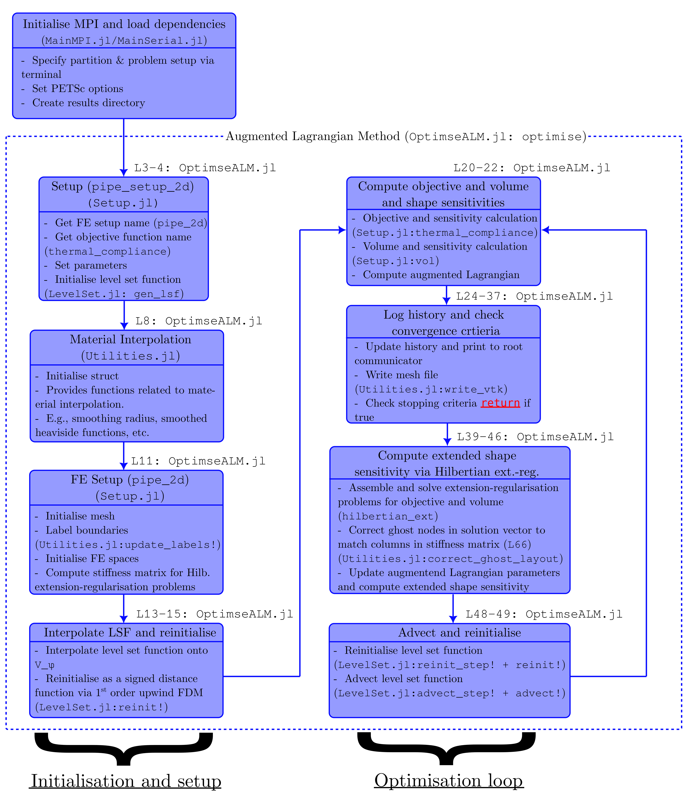

# LSTO_Distributed

## Setup:

1. Download and activate repo in Julia using `]` followed by `activate .`.
2. Download dependencies using `]` followed by `instantiate`.
3. Configure    
    * (Desktop) install `mpiexecjl` by running `using MPI; MPI.install_mpiexecjl()` in Julia. Add `.../.julia/bin/` to system path.
    * (HPC) It is best to utilise pre-exisiting MPI and PETSc installations on the HPC. The PBS Pro script provided below builds required packges with system settings.
4. Run 
    * (Desktop) `mpiexecjl` from terminal (GIT Bash if on Windows). E.g.,
        `mpiexecjl --project=. -n 4 julia MainMPI.jl pipe_setup_2d 2 2`
    * (HPC) Queue a run script - see examples provided.

## Options:
We typically execute `mpiexecjl` from the terminal via the following
    `mpiexecjl --project=. -n NP julia MainMPI.jl SETUP_NAME NX NY NZ`
where
* `NP` -> Number of processors to launch,
* `SETUP_NAME` -> Name of setup function,
* `NX` -> Number of partitions in X,
* `NY` -> Number of partitions in Y,
* `NZ` -> Number of partitions in Z (optional).


`MainMPI` can also be replaced by `MainSerial` to run the code in serial mode (currently this is quite slow?).

## Output & Visualisation
Output files consist of a `.csv` file containing the iteration history, `.pvtu` files and `.vtu` files in corresponding subdirectories. For the augmented Lagrangian method the `history.csv` file consists of three columns for the objective, volume, and Lagrangian respectively.

Results can be visualised in Paraview via the following:

&nbsp;&nbsp;&nbsp;&nbsp;&nbsp;&nbsp;Open (any `.pvtu`) -> Apply -> `CTRL + Space` -> `Iso Volume`

Use the following settings in the `Iso Volume` filter: `Input Scalars` = `phi`, `Minimum` = -1, `Maximum` = 0.

Bug: Currently `.pvtu` files contain the whole path to the corresponding `.vtu` instead of the relative path. This is caused by passing the whole path to `write_vtk`. Passing the relative path to `write_vtk` includes the location folder in the path to each piece (`.vtu` file). If moving several visualisation files use the command (replace `/` by `\/` in `PATH` below)
    `sed -i 's/PATH/./g' *.pvtu`

## Algorithm Overview:
The flowchart below gives a rough overview of the augmented Lagrangian-based optimisation algorithm for the problem `pipe_setup_2d` with objective `thermal_compliance`.



## HPC PBS Scripts:

The following PBS script is provided for setting up `MPI.jl` in conjuction with `GridapDistributed.jl`, `GridapPETSc.jl`, and `MUMPS` on a PBS Pro-based HPC cluster:
```
#!/bin/bash -l

#PBS -P LSTO_Distributed_Setup
#PBS -l ncpus=1
#PBS -l mem=32GB
#PBS -l walltime=00:30:00
#PBS -j oe

module load julia/1.8.3-linux-x86_64
module load mumps/5.5.1-foss-2022a-metis
module load petsc/3.18.6-foss-2022a
module load openmpi/4.1.4-gcc-11.3.0

# Path to PETSc Library - replace with appropriate system path
export JULIA_PETSC_LIBRARY=$EBROOTPETSC/lib/libpetsc.so 

cd $PBS_O_WORKDIR

julia --project=. -e 'using Pkg; Pkg.instantiate()'
echo '------------------------------------------------------------'
julia --project -e 'using Pkg; Pkg.add("MPIPreferences"); 
    using MPIPreferences; MPIPreferences.use_system_binary()'
echo '------------------------------------------------------------'
julia --project=. -e 'using MPI; MPI.install_mpiexecjl()'
echo '------------------------------------------------------------'
julia --project=. -e 'using Pkg; Pkg.build("MPI"; verbose=true);
    Pkg.build("GridapPETSc")'
echo '------------------------------------------------------------'
julia --project=. -e 'using MPI, Gridap, GridapDistributed, GridapPETSc'
echo '------------------------------------------------------------'
echo 'Done'
```

The following PBS script can be used to run the code on a PBS Pro-based HPC:
```
#!/bin/bash -l

#PBS -P LSTO_Dist_Pipe
#PBS -l cputype=7713
#PBS -l ncpus=27
#PBS -l mpiprocs=27
#PBS -l mem=128GB
#PBS -l walltime=48:00:00
#PBS -j oe

module load julia/1.8.3-linux-x86_64
module load mumps/5.5.1-foss-2022a-metis
module load petsc/3.18.6-foss-2022a
module load openmpi/4.1.4-gcc-11.3.0

# Path to PETSc Library - replace with appropriate system path
export JULIA_PETSC_LIBRARY=$EBROOTPETSC/lib/libpetsc.so
export mpiexecjl=~/.julia/bin/mpiexecjl

cd $PBS_O_WORKDIR

$mpiexecjl --project=. -n 27 julia ./MainMPI.jl pipe_setup_3d 3 3 3
```
