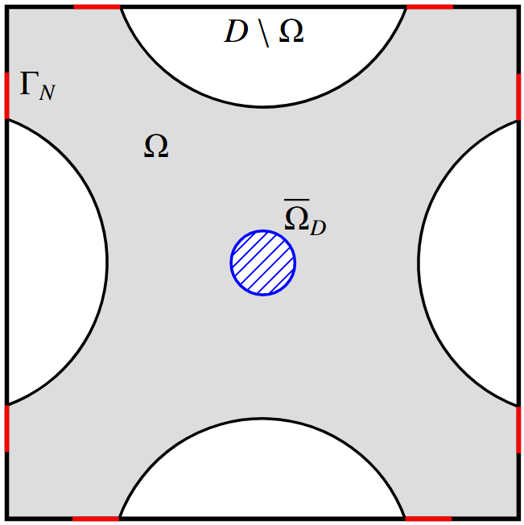

# Topology optimisation on unfitted meshes

In this tutorial, we will learn:
- How to formulate a Laplace's equation with CutFEM based on [Burman et al. (2015)](https://doi.org/10.1002/nme.4823)
- How to use unfitted discretisations from [GridapEmbedded](https://github.com/gridap/GridapEmbedded.jl/) in GridapTopOpt
- How to use automatic (unfitted) shape differentation

This tutorial is for intermediate-level users. You should be familar with the GridapTopOpt framework before attempting this tutorial. In addition, it is recommended that this [Gridap tutorial](https://gridap.github.io/Tutorials/dev/pages/t020_poisson_unfitted/) is read before attempting the below.

## Problem formulation
The goal of this tutorial is to solve a level-set topology optimisation problem with an unfitted
discretisation and automatic shape differentiation. To simplify this tutorial, we consider Laplace's
equation for the underlying PDE. Specifically, the PDE-constrained optimisation problem that we consider
is
```math
\begin{aligned}
    \min_{\Omega\subset D}&~J(\Omega)\coloneqq\int_{\Omega(\phi)}\boldsymbol{\nabla}u\cdot\boldsymbol{\nabla}u~\mathrm{d}\boldsymbol{x}\\
    \text{s.t. }&~C(\Omega)=0,\\
    &~\left\lbrace\begin{aligned}
    -\boldsymbol{\nabla}^2u &= 0~\text{in }\Omega,\\
\boldsymbol{\nabla} u\cdot\boldsymbol{n} &= 1~\text{on }\Gamma_N,\\
\boldsymbol{\nabla} u\cdot\boldsymbol{n} &= 0~\text{on }\Gamma,\\
u &= 0~\text{on }\overline{\Omega}_D,
    \end{aligned}\right.
\end{aligned}
```
where $C(\Omega)=(\operatorname{Vol}(\Omega) - 0.3)/\operatorname{Vol}(D)$ constrains the volume of $\Omega$. The
background domain $D$ and boundary conditions are shown below:

<p align="center">

</p>

## Unfitted formulation
In the following, we discretise the PDE governing $u$ using CutFEM based on [Burman et al. (2015)](https://doi.org/10.1002/nme.4823). The weak formulation for this problem is: for $V=H^1(\Omega;u_{\Gamma_D}=0)$, find $u\in V$ such that
```math
\int_{\Omega(\phi)}\boldsymbol{\nabla}u\cdot\boldsymbol{\nabla}v~\mathrm{d}\boldsymbol{x} + j(u,v) + i(u,v) = \int_{\Gamma_N}v~\mathrm{d}s,~\forall v\in V.
```
Those who are familiar with deriving the weak form will notice that we have two addition terms in this formulation. The first is the so-called ghost penalty term $j(u,v)$ that extends coercivity of the bilinear form from the physical domain to the cut domain. This is given by
```math
j(u,v)=\int_{\Gamma_g}\gamma h \llbracket \boldsymbol{n}\cdot\boldsymbol{\nabla}u\rrbracket\llbracket \boldsymbol{n}\cdot\boldsymbol{\nabla}v\rrbracket~\mathrm{d}s.
```
The second term $i(u,v)$ enforces zero temperature within an isolated volumes marked by $\chi$. We can think of these isolated volumes as blobs of material that are not sufficently constrained. As a result, without an additional constraint on these "blobs", an unfitted discretisation will yield infinite solutions. This term is given by
```math
i(u,v) = \int_{\Omega(\phi)}\chi uv~\mathrm{d}\boldsymbol{x}
```
Note that this only acts on the isolated volumes marked by $\chi$. As a result, the problem is still consistent.

## Setup and parameters
As usual, we start by loading the required libraries and defining any parameters:
```julia
using Gridap, Gridap.Adaptivity, Gridap.Geometry
using GridapEmbedded, GridapEmbedded.LevelSetCutters
using GridapTopOpt, GridapSolvers

using GridapTopOpt: StateParamMap

path="./results/Unfitted_Thermal2D/"
mkpath(path)
# Params
n = 50            # Initial mesh size (pre-refinement)
max_steps = n/5   # Time-steps for evolution equation
vf = 0.3          # Volume fraction
α_coeff = 2       # Regularisation coefficient extension-regularisation
iter_mod = 1      # Write output every iter_mod iterations
```

Here, we deictate that the initial mesh size is $50^2$ quadrilateral elements, the time steps for the evolution equation is set to $n/5$, the required volume fraction is 0.3, the reguarisation coefficent for the Hilbertian extension-regularisation is 2, and we data files at each iteration.
## Mesh with refinement
For this problem, we use a refined mesh using Gridap's adaptivity features. In addition, we mark mesh entities that are part of $\overline{\Omega}_D$ and $\Gamma_N$:
```julia
# Base model
_model = CartesianDiscreteModel((0,1,0,1),(n,n))
base_model = UnstructuredDiscreteModel(_model)
# Refinement
ref_model = refine(base_model, refinement_method = "barycentric")
ref_model = refine(ref_model)
ref_model = refine(ref_model)
model = ref_model.model
# Get mesh size
h = minimum(get_element_diameters(model))
hₕ = get_element_diameter_field(model)
# Mark mesh entities
f_Γ_D(x) = (x[1]-0.5)^2 + (x[2]-0.5)^2 <= 0.05^2
f_Γ_N(x) = ((x[1] ≈ 0 || x[1] ≈ 1) && (0.2 <= x[2] <= 0.3 + eps() || 0.7 - eps() <= x[2] <= 0.8)) ||
  ((x[2] ≈ 0 || x[2] ≈ 1) && (0.2 <= x[1] <= 0.3 + eps() || 0.7 - eps() <= x[1] <= 0.8))
update_labels!(1,model,f_Γ_D,"Omega_D")
update_labels!(2,model,f_Γ_N,"Gamma_N")
writevtk(model,path*"model")
```

## FESpace for level-set function and derivatives
In example, we consider piecewise linear cuts defined via a level-set function. As such, the level-set function should be discretised using continuous piecewise-linear finite elements. In addition, we use the same space for the derivatives, except we also constrain the derivative space so that the shape derivatives are zero on $\overline{\Omega}_D$ and $\Gamma_N$.
```julia
reffe_scalar = ReferenceFE(lagrangian,Float64,1)
V_φ = TestFESpace(model,reffe_scalar)
V_reg = TestFESpace(model,reffe_scalar;dirichlet_tags=["Omega_D","Gamma_N"])
U_reg = TrialFESpace(V_reg)
```
Next, we build the initial level-set function using
```julia
f1 = (x,y) -> -cos(6π*(x-1/12))*cos(6π*(y-1/12))-0.5
f2 = (x,y) -> -cos(6π*(x-3/12))*cos(6π*(y-1/12))-0.5
f3 = (x,y) -> (x-0.5)^2 + (y-0.5)^2 - 0.06^2
f((x,y)) = min(max(f1(x,y),f2(x,y)),f3(x,y))
φh = interpolate(f,V_φ)
```
Before defining the triangulation, we need to ensure that the initial cut interface defined by the level-set function does not intersect the vertices in the background domain. We do this using:
```julia
GridapTopOpt.correct_ls!(φh)
```

## Background triangulations and measures
Next we define the measures for the background domain as usual
```julia
Ω_bg = Triangulation(model)
Γ_N = BoundaryTriangulation(model,tags="Gamma_N")
dΩ_bg = Measure(Ω_bg,2)
dΓ_N = Measure(Γ_N,2)
vol_D = sum(∫(1)dΩ_bg)
```

## Embedded triangulations and measures
To make it possible to update the embedded triangulations, measures, and the indicator function we use an `EmbeddedCollection`. This is given by
```julia
Ωs = EmbeddedCollection(model,φh) do cutgeo,cutgeo_facets,_φh
  Ωin = DifferentiableTriangulation(Triangulation(cutgeo,PHYSICAL),V_φ)
  Γ = DifferentiableTriangulation(EmbeddedBoundary(cutgeo),V_φ)
  Γg = GhostSkeleton(cutgeo)
  Ωact = Triangulation(cutgeo,ACTIVE)
  φ_cell_values = get_cell_dof_values(_φh)
  χ,_ = get_isolated_volumes_mask_polytopal(model,φ_cell_values,["Omega_D",])
  (;
    :Ωin  => Ωin,
    :dΩin => Measure(Ωin,2),
    :Γg   => Γg,
    :dΓg  => Measure(Γg,2),
    :n_Γg => get_normal_vector(Γg),
    :Γ    => Γ,
    :dΓ   => Measure(Γ,2),
    :n_Γ  => get_normal_vector(Γ),
    :Ωact => Ωact,
    :χ => χ
  )
end
```
The `do` statement above provides a recipe for the `EmbeddedCollection` to generate the data in `Ωs` that can be accessed, for example, via `Ωs.Ωin`. The contents of `Ωs` can then be updated via `update_collection!(c::EmbeddedCollection,φh)`. In addition, new recipes can be added using `add_recipe!(c::EmbeddedCollection,r::Function[,φh])`. Inside `EmbeddedCollection`, cut geometries are created and then passed to recipes when `update_collection!` is called.

## Isolated volume marking and automatic differentation
In the above, we use `get_isolated_volumes_mask_polytopal` to create a cell field that marks cells based on whether they are connected to `Omega_D`. In addition, we wrap the cut triangulations inside [`DifferentiableTriangulation`](https://gridap.github.io/GridapEmbedded.jl/stable/GeometricalDerivatives/#Geometrical-Derivatives). This is a wrapper around an embedded triangulation (i.e SubCellTriangulation or SubFacetTriangulation) implementing all the necessary methods to compute derivatives with respect to deformations of the embedded mesh. To do so, it propagates dual numbers into the geometric maps mapping cut subcells/subfacets to the background mesh. We refer to this article for the mathematical discussion:
> Wegert, Z.J., Manyer, J., Mallon, C.N. et al. Level-set topology optimisation with unfitted finite elements and automatic shape differentiation. arXiv:2504.09748 [math] \(2025\). [http://arxiv.org/abs/2504.09748](http://arxiv.org/abs/2504.09748)

## FE problem
Now that all the measures are defined, lets define the weak form, optimisation functionals, and the FE operators. First, we can define the weak form and optimisation functionals as
```julia
γg = 0.1
a(u,v,φ) = ∫(∇(v)⋅∇(u))Ωs.dΩin +
           ∫((γg*mean(hₕ))*jump(Ωs.n_Γg⋅∇(v))*jump(Ωs.n_Γg⋅∇(u)))Ωs.dΓg +
           ∫(Ωs.χ*v*u)Ωs.dΩin
l(v,φ) = ∫(v)dΓ_N
```
and
```julia
J(u,φ) = ∫(∇(u)⋅∇(u))Ωs.dΩin
Vol(u,φ) = ∫(1/vol_D)Ωs.dΩin - ∫(vf/vol_D)dΩ_bg
dVol(q,u,φ) = ∫(-1/vol_D*q/(abs(Ωs.n_Γ ⋅ ∇(φ))))Ωs.dΓ
```
We have directly computed the shape derivative of the volume functional using the analytical results by Wegert et al. \(2025\) referenced above.

Next, we setup the `AffineFEStateMap` and `PDEConstrainedFunctionals` objects. Here we use another new objective `EmbeddedCollection_in_φh` that is similar to `EmbeddedCollection` except it does not cut the mesh and only expects recipes that take arguments in `φh`. This allows us to update the spaces and state maps whenever required. Note that this is different to how we usually setup these objects because we have to recreate the FE spaces and state maps at each iteration. This is because the active mesh for the unfitted discretisation is changing over the course of the level-set evolution. This new `state_collection` holds the state map, the objective as a `StateParamMap`, and set of `StateParamMap` for the constraints. This is given by the follow snippet
```julia
state_collection = EmbeddedCollection_in_φh(model,φh) do _φh
  update_collection!(Ωs,_φh)
  V = TestFESpace(Ωs.Ωact,reffe_scalar;dirichlet_tags=["Omega_D"])
  U = TrialFESpace(V,0.0)
  state_map = AffineFEStateMap(a,l,U,V,V_φ,U_reg,_φh)
  (;
    :state_map => state_map,
    :J => StateParamMap(J,state_map),
    :C => map(Ci -> StateParamMap(Ci,state_map),[Vol,])
  )
end
```
Note that `StateParamMap` is a wrapper to handle partial differentation of a function in a `ChainRules.jl` compatible way with caching. See [this documentation](./../reference/statemaps.html#StateParamMap) for further information.

Next, we create the `EmbeddedPDEConstrainedFunctionals`. This is similar to `PDEConstrainedFunctionals` except it takes `state_collection` as the argument and updates the unfitted triangulations where appropriate.
```julia
pcfs = EmbeddedPDEConstrainedFunctionals(state_collection;analytic_dC=(dVol,))
```

## Evolution
We now define the evolution and reinitialisation methods for this problem. Here we use unfitted approaches to solve both of these problems

To set these up, we provide `CutFEMEvolve` and `StabilisedReinit` as follows:
```julia
evo = CutFEMEvolve(V_φ,Ωs,dΩ_bg,hₕ;max_steps,γg=0.1)
reinit = StabilisedReinit(V_φ,Ωs,dΩ_bg,hₕ;stabilisation_method=ArtificialViscosity(2.0))
```
We then define the `UnfittedFEEvolution` object that wraps these methods, and we reinitialise our initial level-set function via
```julia
ls_evo = UnfittedFEEvolution(evo,reinit)
reinit!(ls_evo,φh)
```

## Hilbertian extension-regularisation problems
The Hilbertian extension-regularisation approach projects a directional derivative $\mathrm{d}J(\phi;w)$ of a functional $J(\phi)$ onto a Hilbert space $H$ on $D$, typically with additional regularity. This involves solving an identification problem: for Find $g_\Omega\in H$ such that
```math
\langle g_\Omega,w\rangle_H=-\mathrm{d}J(\phi;w),~\forall w\in H,
```
where $\langle\cdot,\cdot\rangle_H$ is the inner product on $H$. Here, we use $H=H^1_{\Omega_D\cup\Gamma_N}(D)$ with the inner product
```math
    \langle u,v\rangle_{H}=\int_D\left(\alpha^2\boldsymbol{\nabla} u\cdot\boldsymbol{\nabla} v+uv\right)\mathrm{d}\boldsymbol{x}.
```
This is implemented as follows:
```julia
α = (α_coeff)^2*hₕ*hₕ
a_hilb(p,q) =∫(α*∇(p)⋅∇(q) + p*q)dΩ_bg;
vel_ext = VelocityExtension(a_hilb,U_reg,V_reg)
```

## Optimiser and solution
Finally, for the optimiser we use the `AugmentedLagrangian` method with the convergence criteria below. In addition, we output data on the background mesh, along with the solution $u_h$ on the unfitted triangulation. This is given by the following:
```julia
converged(m) = GridapTopOpt.default_al_converged(
  m;
  L_tol = 0.01*h,
  C_tol = 0.01
)
optimiser = AugmentedLagrangian(pcfs,ls_evo,vel_ext,φh;verbose=true,constraint_names=[:Vol],converged)
for (it,uh,φh) in optimiser
  if iszero(it % iter_mod)
    writevtk(Ω_bg,path*"Omega$it",cellfields=["φ"=>φh,"|∇(φ)|"=>(norm ∘ ∇(φh)),"uh"=>uh,"χ"=>Ωs.χ])
    writevtk(Ωs.Ωin,path*"Omega_in$it",cellfields=["uh"=>uh])
  end
  write_history(path*"/history.txt",optimiser.history)
end
it = get_history(optimiser).niter; uh = get_state(pcfs)
writevtk(Ω_bg,path*"Omega$it",cellfields=["φ"=>φh,"|∇(φ)|"=>(norm ∘ ∇(φh)),"uh"=>uh,"χ"=>Ωs.χ])
writevtk(Ωs.Ωin,path*"Omega_in$it",cellfields=["uh"=>uh])
```

Solving this problem results in the following iteration history:
<p align="center">

</p>

The full script for this problem can be found [here](../../../scripts/Examples/Unfitted/Thermal2D_CutFEM.jl).